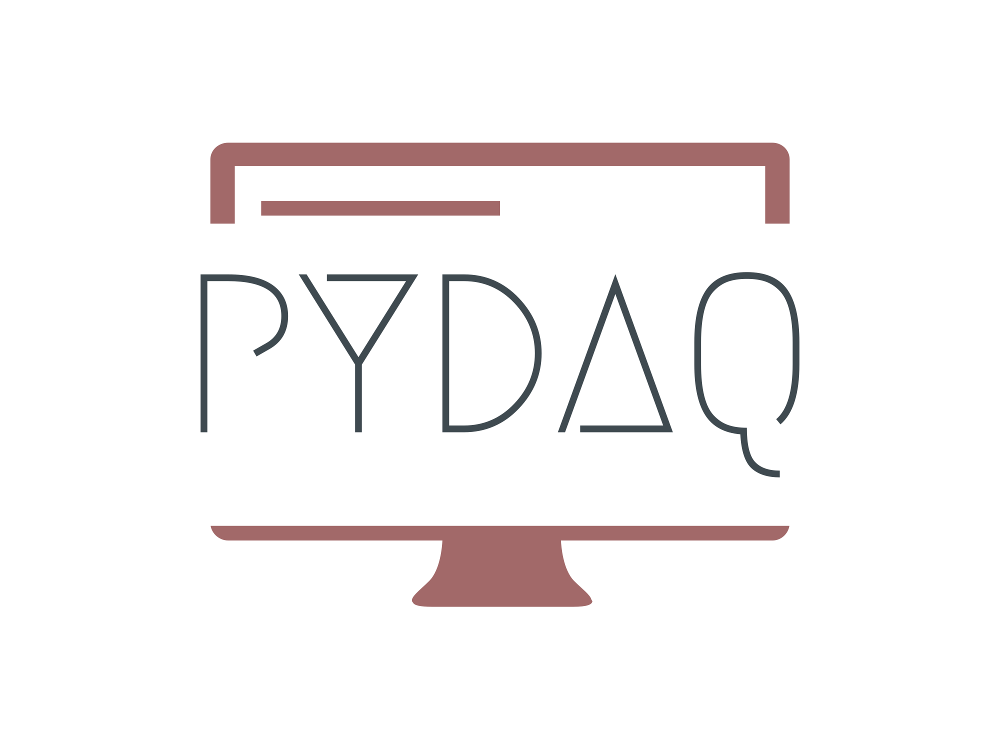
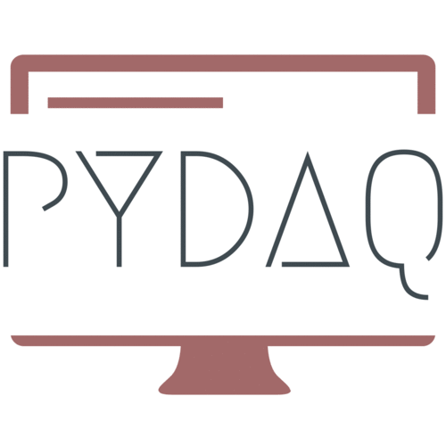

<p align="center">
  
</p> 

[](https://github.com/samirmartins/pydaq)
[](https://opensource.org/licenses/BSD-3-Clause)
[](https://pypi.org/project/pydaq/)
[](https://pypi.org/project/pydaq/)
[](https://github.com/samirmartins/pydaq/graphs/contributors)
[](https://pypi.org/project/pydaq/)
[](https://github.com/samirmartins/pydaq/issues)
[](https://github.com/samirmartins/pydaq/issues)
[](https://github.com/samirmartins/pydaq/network/members)
[](https://github.com/samirmartins/pydaq/stargazers)


# PYDAQ - Data Acquisition and Experimental Analysis with Python

## www.pydaq.org


----
Using Python for applications with experimental data (Arduino and NIDAQ boards)
----

This package was initially designed to use an experimental device for data 
acquisition and signal generation when performing different experiments, 
such as a step-response test. However, from version v0.0.5 onwards, 
PYDAQ introduces different functionalities, including real-time system 
identification using experimental data.

One can use PYDAQ using different boards [(check jupyter notebook examples folder)](examples), 
through a Graphical User Interface or via command line. 

It is noteworthy that this application makes data acquisition, system identification
and empirical experiments simpler, faster and easier. This is relevant
when the user needs empirical data to construct black box linear and
nonlinear models, commomly used in research projects in forecasting and 
model-based control schemes.
 
The code provided here allows user to save acquired data in .dat files in 
a path specified by the user (or at Desktop, if no path is provided), as well
as send a user-defined data, which can be any nonlinear input signal 
[(you are strongly advised to check the docs)](https://pydaq.org)

In what follows you will find

- Installation and Requirements
- Quick view and Main features 
- Using Graphical User Interface
- Screenshots


---
Installation and Requirements
---

The fastest way to install PYDAQ is using pip:

```console
pip install pydaq
```

PYDAQ requires:

- Driver of the board used (Arduino or National Instruments NIDAQ)
- nidaqmx (>=0.6.5) for data acquisition from National Instruments Boards
- matplotlib (>=3.5.3) as a visualization tool
- numpy (>=1.22.3) to process data
- PySide6 (>=6.7.1), PySide6_Addons, PySide6_Essentials and shiboken6 as a Graphical User Interface framework
- pyserial (>=3.5) to manage data to/from Arduino
- sysidentpy (==0.3.4) and bitarray (>=3.0.0) for model acquisition/signal generation
- packaging (>=24.1).

**NOTE 1:** In this version of pydaq (0.0.5), [(NI-DAQmx drivers)](https://www.ni.com/en/support/downloads/drivers/download.ni-daq-mx.html#494676) must be installed, even if 
the user is only using Arduino Boards. This issue will be addressed in future versions, allowing
Arduino users to use PYDAQ without having to install NI-DAQmx drivers.

**NOTE 2:** PYDAQ is fully tested up to Python 3.10. It may run on versions above this, but without guarantees. 


---
Quick view and Main features
---

| Feature                       |                                                                                                                                                                                                                                                                                                                                                                           Description |
|-------------------------------|--------------------------------------------------------------------------------------------------------------------------------------------------------------------------------------------------------------------------------------------------------------------------------------------------------------------------------------------------------------------------------------:|
| Send Data (Arduino/NIDAQ)     |                                                                                                                                                                                                                                                                            This feature allows the user to send data through any Arduino/NIDAQ board using a graphical user interface |
| Get Data (Arduino/NIDAQ)      |                                                                                                                                             Here the user is able to get data from a(n) Arduino/NIDAQ board (using any terminal configuration - Diff, RSE, NRSE - in NIDAQ case), sample time and other parameters. Acquired data can also be saved and plot for further applications |
| Step Response (Arduino/NIDAQ) |                                                                                                                         In this feature one can perform an automatic step response experiment using a(n) Arduino/NIDAQ board. Data genereted by the experiment can also be saved to be used in further applications, such as obtaining linear and nonlinear models from acquired data |
| Get Model (Arduino/NIDAQ)     | The user can obtain mathematical models experimentally using Arduino/NIDAQ boards, with various customization options available. The input signal is a PRBS, which can be customized to meet specific needs, and both the input and output signals obtained can be saved for future applications. PYDAQ uses [SysIdentPy](www.sysidentpy.org) as a backend for obtaining the models. |
 

---
Using GUI (more details in [documentation](https://samirmartins.github.io/pydaq/) and [jupyter notebook examples](examples)):
---

All functionalities for all boards are incorporated in one single window.

### Launching the GUI:

```python
from pydaq.pydaq_global import PydaqGui

PydaqGui()
```

Further details can be found in [documentation](https://pydaq.org).

---
Screnshots (v0.0.5)
---

<p align="center">
  
</p>

---
Contributing
---

You are more than welcome to make your contribution and submit a pull request. To contribute, [read this guide](/CONTRIBUTING.md).


---
CITATION
---
[](https://doi.org/10.21105/joss.05662)

If you are using PYDAQ on your project, you can cite us as following: 

- Martins, S. A. M. (2023). PYDAQ: Data Acquisition and Experimental Analysis with Python. Journal of Open Source Software, 8(92), 5662. https://doi.org/10.21105/joss.05662

```bibtex
@article{Martins_PYDAQ_Data_Acquisition_2023,
  author = {Martins, Samir Angelo Milani},
  doi = {10.21105/joss.05662},
  journal = {Journal of Open Source Software},
  month = dec,
  number = {92},
  pages = {5662},
  title = {{PYDAQ: Data Acquisition and Experimental Analysis with Python}},
  url = {https://joss.theoj.org/papers/10.21105/joss.05662},
  volume = {8},
  year = {2023}
}
```
