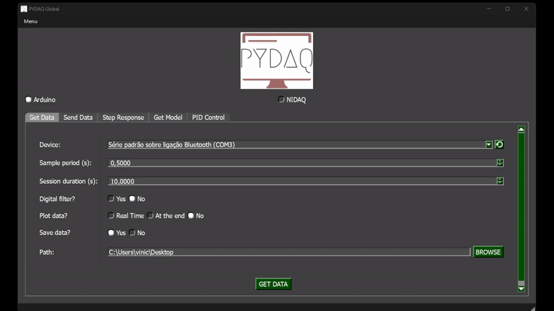

# Benchmarking

## Benchmarking – Minimum Supported Sampling Period Evaluation
This benchmarking function was developed to test the computer's performance under high-frequency data acquisition conditions. Its primary purpose is to evaluate how the system behaves when subjected to extremely low sampling periods, simulating real-time processing demands.

The function runs a controlled loop for a specified duration, attempting to execute iterations at fixed time intervals defined by the user. During execution, the actual time between each iteration is measured and logged. This allows for the analysis of processing consistency, timing deviations, and the system's ability to maintain the desired sampling rate.

At the end of the test, the function automatically estimates and reports the minimum sampling period that the system can reliably support without significant timing violations or data loss. This result helps developers understand the performance limits of the target machine and configure their applications accordingly.

