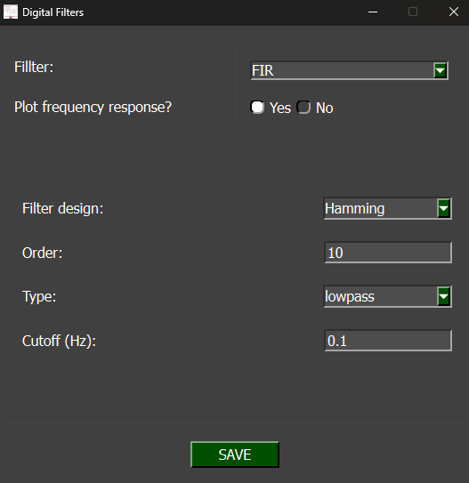
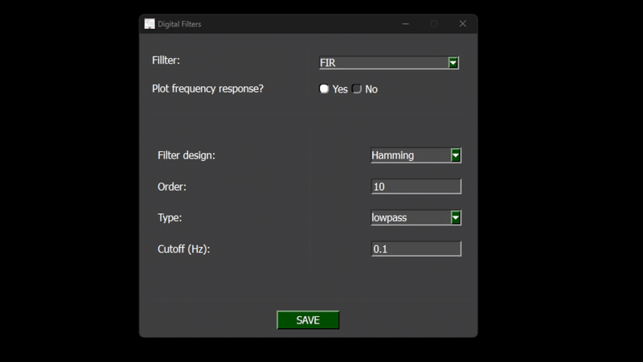

# NIDAQ Digital Filters 

**NOTE**: Before working with PYDAQ, the device driver should be installed and working correctly as a DAQ (Data Acquisition) device.

## Filtering using Graphical User Interface (GUI)

Using the digital filters through the GUI is very simple, and with just two lines of code, you can open the GUI:

```python
from pydaq.pydaq_global import PydaqGui

PydaqGui()
```

After running the command, the GUI will appear. Navigate to the 'Get Data' screen, where you'll see a radio button to choose whether or not to apply the digital filters. When the 'Yes' option is selected, a new window will appear.



## Parameters

- **Filter**: Select the type of filter to use — FIR or IIR.

- **Plot frequency response**: Choose whether to display the filter's frequency response after data acquisition.

- **Filter design**: Select the design method for the filter.

- **Order**: Specify the filter order by entering a numerical value.

- **Type**: Define the filter type — choose from Lowpass, Highpass, Bandpass, or Bandstop.

- **Cutoff**: Set the filter’s cutoff frequency (or frequencies, depending on the filter type).

## Real-Time Filter

After configuring the digital filter parameters, they will be applied to the real-time data acquisition, as shown in the image below:




