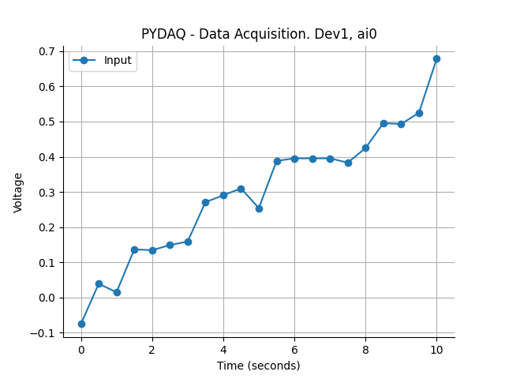

# Data Acquisition with NIDAQ Boards

**NOTE**: before working with PYDAQ, device driver should be installed and working correctly as a DAQ (Data Acquisition)
device

## Data Acquitition using Graphical User Interface (GUI)

Using GUI to acquire data is really straighforward and require only
two LOC (lines of code):

```python
from pydaq.pydaq_global import PydaqGui

# Launch the interface
PydaqGui()
```

After this command, the graphical user interface screen will show up, where the
user should select the NIDAQ option and go to the Get Data tab,
to be able to define parameters and start to acquire data.


The user is now able to select desired device, channel, terminal configuration
(Differential, RSE and NRSE), sample period and session duration. Also,
the user will define if the data will or not be plotted and saved, as well as the path to
save data.

## Data Acquitition using command line

It will be presented how to use GetData (and get_data_nidaq) to acquire signal using a National Instruments board.

Firstly, import library and define parameters:

```python
# Importing PYDAQ
from pydaq.get_data import GetData

# Defining parameters
device_name = "Dev1"
channel_used = "ai0"
terminal_configuration = 'Diff'
sample_period_in_seconds = 1
session_duration_in_seconds = 10.0
save_data = True
will_plot = "no" # Can be realtime, end or no
```

Then, instantiate a class with defined parametes and get the data

```python
# Class GetData
g = GetData(device=device_name,
            channel=channel_used,
            terminal=terminal_configuration,
            ts=sample_period_in_seconds,
            session_duration=session_duration_in_seconds,
            save=save_data,
            plot_mode=will_plot)

# Method get_data_nidaq
g.get_data_nidaq()
```

**NOTE**: data will be saved on desktop, by default. To change the path the user can define "g.path = Desired path"

## Presenting acquired data

To show acquired data, type:

```python
print(f'First 10 values of time: \n {g.time_var[0:10]}')
print(f'\nFirst 10 values of data: \n {g.data[0:10]}')
```

If you choose to plot you can see acquired data on screen, i.e:



Data will also be saved as depicted below:

