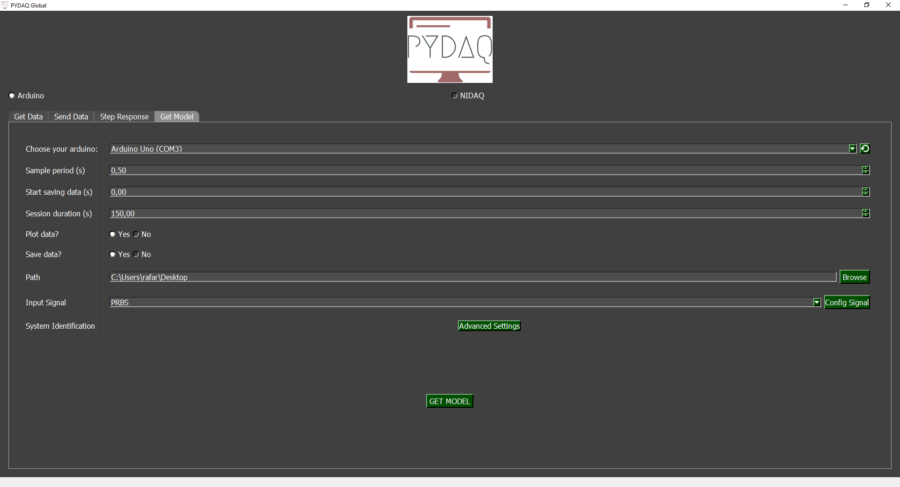

# Model Acquisition with Arduino

**NOTE 1**: before working with PYDAQ, device driver should be installed and working correctly as a DAQ (Data Acquisition) device

**NOTE 2:** To get models with Arduino, [the code provided here](https://github.com/samirmartins/pydaq/tree/main/pydaq/arduino_code) 
should be firstly uploaded in your Arduino board. Default input port is A0, and default output port is 13. Those ports can be changed 
in the above-mentioned code. This code only works with digital output, since this is a limitation of Arduino Boards.

**NOTE 3:** PYDAQ is programmed to use 10 bits as an ADC resolution, and 0V and 5V as the input range.
To change this, the user can alter the following variables:

```python
self.arduino_ai_bits = 10
self.ard_ai_max = 5
self.ard_ai_min = 0
```

## Adquiring the model using Graphical User Interface (GUI)

Using GUI to adquire the model is really straighforward and 
require only two LOC (lines of code):

```python
from pydaq.pydaq_global import PydaqGui

PydaqGui()
```
After this command, the following screen will show up. In "Get Model" 
screen the user is able to define parameters and start the experiment to adquire the model.



## Parameters

 - **Choose your Arduino**: This option allows you to choose the Arduino you are going to use.

 - **Sample Period**: The user can change the sample period, i.e., time (in seconds) between samples.

 - **Start saving data**: Choose when the data will start being recorded to obtain the model.

 - **Session duration**: The user can choose the session duration.

 - **Plot and Save data**: The user can choose whether to plot and save the data.

 - **Path**: Choose where data will be saved.

### Input Signal
#### PRBS
A pseudorandom binary sequence (PRBS) is a deterministic signal that alternates between two values and exhibits characteristics similar to white noise. The PRBS signal is inherently periodic, with a maximum period length of 2ⁿ–1, where n represents the order of the PRBS.
For more information: [Nonlinear System Identification: Theory and Practice with Sysidentpy](https://sysidentpy.org/book/0%20-%20Preface/).

In the **Config signal** button, the user can customize the signal parameters.

### Advanced Settings
The library used for obtaining mathematical models is [SysidentPy](https://sysidentpy.org). It is a Python module for System Identification using NARMAX models, built on top of numpy and distributed under the 3-Clause BSD license. You can configure its parameters and customize the way the mathematical model is obtained. Read more about this in the [SysidentPy documentation](https://sysidentpy.org/).

By pressing the **Get Model** button, the program will start and the model will be obtained.

## Run Get model from the command line
```python

# Importing PYDAQ
from pydaq.get_model import GetModel

# Defining parameters
com_port_arduino = 'COM3'
session_duration_in_s = 100
sample_period_in_s = 0.5
save_data = True
plot_data = True

# system identification parameters
degree = 2
start_save_time_in_s = 0
out_lag = 2
inp_lag = 2
num_info_val = 6
estimator = 'least_squares'
ext_lsq = True
perc_value_to_train_the_model = 15

# PRBS input parameters
prbs_bits = 6
prbs_seed = 100
var_tb = 1

# Class GetModel
g = GetModel(
    com= com_port_arduino,
    session_duration= session_duration_in_s,
    ts= sample_period_in_s,
    save= save_data,
    plot= plot_data,
    degree= 2,
    start_save_time= start_save_time_in_s,
    out_lag= out_lag,
    inp_lag= inp_lag,
    num_info_values= num_info_val,
    estimator= estimator,
    ext_lsq= ext_lsq,
    perc_value= perc_value_to_train_the_model,
    prbs_bits= prbs_bits,
    prbs_seed= prbs_seed,
    var_tb= var_tb
    )

# Method get_model_arduino
g.get_model_arduino()

```
**NOTE**: data will be saved on desktop, by default. To change the path the user can define "g.path = Desired path".

If the user chooses to plot, this screen will appear:


At the end of the user-defined time, screens with the results will be shown as depicted below.

## Example GIF


