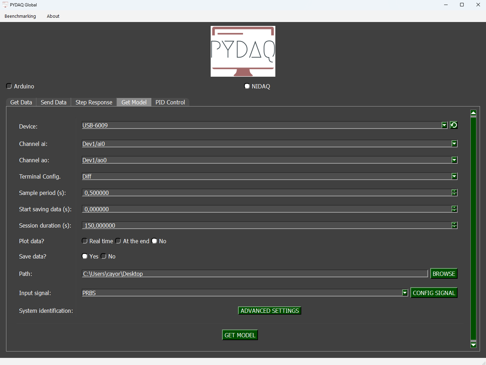

# Model Acquisition with NIDAQ Boards

**NOTE**: before working with PYDAQ, device driver should be installed and working correctly as a DAQ (Data Acquisition) device

## Adquiring the model using Graphical User Interface (GUI)

Using GUI to adquire the model is really straighforward and require only three LOC (lines of code):

```python
from pydaq.pydaq_global import PydaqGui

PydaqGui()
```
After this command, the following screen will show up, where the user should select the NIDAQ option and go to Get Model tab, to be able to define parameters and start to acquire data.



## Parameters

 - **Choose Device**: The user is able to select desired device.

 - **Choose Channel**: The user is able to select desired channel.

 - **Terminal Configuration**: The user can chance the terminal configuration (Differential, RSE and NRSE).

 - **Sample Period**: The user can change the time interval between sample readings.

 - **Start Saving Data**: Choose when the data will start being recorded to obtain the model.

 - **Session Duration**: The user can choose the session duration, which will change the number of iterations.

 - **Plot and Save data**: The user can choose whether to plot and save the data.

 - **Path**: Choose where the data will be saved.

### Input Signal
#### PRBS
A pseudorandom binary sequence (PRBS) is a deterministic signal that alternates between two values and exhibits characteristics similar to white noise. The PRBS signal is inherently periodic, with a maximum period length of 2ⁿ–1, where n represents the order of the PRBS.
For more information: [Nonlinear System Identification](https://www.amazon.com.br/Nonlinear-System-Identification-Frequency-Spatio-Temporal/dp/1119943590)

In the **Config signal** button, the user can customize the signal parameters.

### Advanced Settings
The library used for obtaining mathematical models is SysidentPy. It is a Python module for System Identification using NARMAX models, built on top of numpy and distributed under the 3-Clause BSD license. You can configure its parameters and customize the way the mathematical model is obtained. Read more about this in the [SysidentPy documentation](https://sysidentpy.org/).

By pressing the **Get Model** button, the program will start and the model will be obtained.

## Run Get model from the command line
from pydaq.get_model import GetModel


# Defining parameters
```python
device_name = ("Dev1",)
ao_channel = ("ao0",)
ai_channel = ("ai0",)
channel = ("ai0",)
terminal = ("Diff",)
ao_min = (0,)
ao_max = (5,)

# system identification parameters
degree = 2
start_save_time_in_s = 0
out_lag = 2
inp_lag = 2
num_info_val = 6
estimator = "least_squares"
ext_lsq = True
perc_value_to_train_the_model = 15

# PRBS input parameters
prbs_bits = 6
prbs_seed = 100
var_tb = 1

# Class GetModel
g = GetModel(
    device=device_name,
    ai_channel=ai_channel,
    ao_channel=ao_channel,
    ao_min=ao_min,
    ao_max=ao_max,
    channel=channel,
    degree=degree,
    start_save_time=start_save_time_in_s,
    out_lag=out_lag,
    inp_lag=inp_lag,
    num_info_values=num_info_val,
    estimator=estimator,
    ext_lsq=ext_lsq,
    perc_value=perc_value_to_train_the_model,
    prbs_bits=prbs_bits,
    prbs_seed=prbs_seed,
    var_tb=var_tb,
)

# Method get_model_nidaq
g.get_model_nidaq()
```
**NOTE**: data will be saved on descktop, by default. To chance the path the user can define "g.path = Desired path".

If the user chooses to plot, this screen will appear:


At the end of the user-defined time, screens with the results will appear.


<Colocar gif mostrando o uso no final>