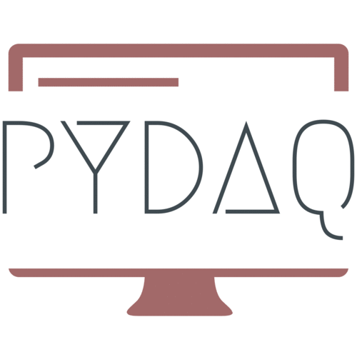

<p align="center">
  
</p>

# Welcome to PYDAQ documentation

## Introduction

This site presents the full documentation of PYDAQ - Data Acquisition and Experimental Analysis with Python.

This package was initially designed to use an experimental device for data 
acquisition and signal generation when performing different experiments, 
such as a step-response test. However, from version v0.0.5 onwards, 
PYDAQ introduces different functionalities, including real-time system 
identification using experimental data. One can use PYDAQ using different boards [(check jupyter notebook examples folder)](https://github.com/samirmartins/pydaq/tree/main/examples), 
through a Graphical User Interface or via command line. 


Also, step-response experiments can be easily performed, as showed up in [Step response (NIDAQ)](https://pydaq.org/step_response_nidaq/) and [Step response (Arduino)](https://pydaq.org/step_response_arduino/).

Furthermore, this tool can be used to apply any generic output in an experimental
tool, such as PRBS (Pseudo Random Binary Signal) or other persistently exciting signal, in order to generate
data for black box system identification.

The user is able to get/send data either using a command line method
of a GUI (Graphical User Interface), speeding up prototypes and quick
experiments, keeping the user confidence in the acquired/sent data.
Besides, the command line interface allows one to keep developing new features
while data are acquired.

## Installation and Requirements

The fastest way to install PYDAQ is using pip:

```console
pip install pydaq
```

PYDAQ requires:

- Driver of the board used (Arduino or National Instruments NIDAQ)
- nidaqmx (>=0.6.5) for data acquisition from National Instruments Boards
- matplotlib (>=3.5.3) as a visualization tool
- numpy (>=1.22.3) to process data
- PySide6 (>=6.7.1), PySide6_Addons, PySide6_Essentials and shiboken6 as a Graphical User Interface framework
- pyserial (>=3.5) to manage data to/from Arduino
- sysidentpy (==0.3.4) and bitarray (>=3.0.0) for model acquisition/signal generation
- packaging (>=24.1).
- scipy (>=1.16.1) for digital filters.

 
## Documentation Map

### Data Acquisition

Here the user will find examples of how to use GUI (Graphical User Interface) and
also commando line to acquire data using [NIDAQ](https://samirmartins.github.io/pydaq/get_data_nidaq/)
or [Arduino](https://samirmartins.github.io/pydaq/get_data_arduino/) boards.

### Sending data

In this Section is presented how the user can send data
from [NIDAQ](https://samirmartins.github.io/pydaq/send_data_nidaq/)
or [Arduino](https://samirmartins.github.io/pydaq/send_data_arduino/),
by mean of command line or a GUI (Graphical User Interface).

### Step response

Here the user will find examples of how to define parameters to perform
a step response experiments with available
boards ([NIDAQ](https://samirmartins.github.io/pydaq/step_response_nidaq/)/[Arduino](https://samirmartins.github.io/pydaq/step_response_arduino/)).

### Get Model

If you need to estimate a model using experimental data, 
this section is for you. Here, you can find 
documentation on how to use PYDAQ for this purpose
with ([NIDAQ](https://samirmartins.github.io/pydaq/get_model_nidaq/)/[Arduino](https://samirmartins.github.io/pydaq/get_model_arduino/))

### PID Control

This section explains how to perform real-time or simulated PID control using PYDAQ. Both [NIDAQ](https://samirmartins.github.io/pydaq/pid_control_nidaq/) and [Arduino](https://samirmartins.github.io/pydaq/pid_control_arduino/) boards are supported, and control (including simulation) can be run through the GUI.

### Digital Filters

This section explains how to design and apply digital filters in PYDAQ. The user can choose the filter type (FIR or IIR), define parameters such as cutoff frequency and order, and apply the filter in real time using either [Arduino](https://samirmartins.github.io/pydaq/pid_control_arduino/) or [NIDAQ](https://samirmartins.github.io/pydaq/pid_control_nidaq/) boards. Everything can be done through the graphical interface, with support for both simulation and live data processing.

### Benchmarking

This section runs a performance test to estimate the maximum sampling frequency your computer can handle reliably. It helps identify how quickly your system can read and process data without delays or data loss. This is useful for applications that require real-time or high-speed data acquisition.


## Examples

In this section it will be provided Jupyter Notebook examples
presenting code
functionalities ([NIDAQ](https://samirmartins.github.io/pydaq/jupyter_notebooks/)/[Arduino](https://samirmartins.github.io/pydaq/jupyter_notebooks/)).

## Screenshots

<p align="center">
  
</p>
