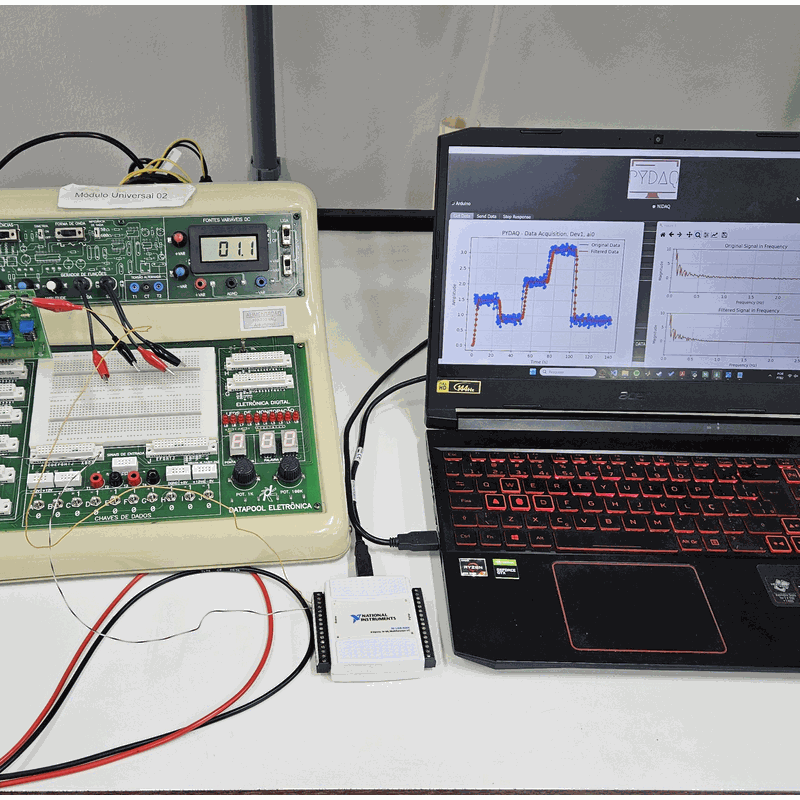

<p align="center">
  
</p>

# Welcome to PYDAQ documentation

## Introduction

**PYDAQ (Python Data Acquisition and Experimental Analysis)** is a framework designed to support **experimental data acquisition, real-time analysis, system identification, and control** using Python. It provides an integrated environment for working with **Arduino** and **National Instruments NIDAQ** boards, supporting both **graphical** and **command-line** workflows.

Initially focused on basic data acquisition and signal generation for experiments such as step-response tests, PYDAQ has evolved into a broader experimental platform. Its development milestones are:

* **Version v0.0.5** introduced **real-time system identification**, enabling the estimation of linear and nonlinear black-box models directly from experimental data.
* **Version v0.0.6** expanded PYDAQ with **real-time digital filtering (FIR and IIR)** and **classical control techniques**, including **PID control with Ziegler–Nichols tuning**, supporting both simulation and live experiments.

PYDAQ can be used through a **Graphical User Interface (GUI)** for rapid experimentation or via a **command-line interface** for scripting, automation, and advanced workflows. These features make the framework suitable for research, teaching laboratories, and rapid prototyping involving empirical data.

---

## Installation and Requirements

The fastest way to install PYDAQ is using `pip`:

```console
pip install pydaq
```

PYDAQ requires:

* Driver of the board used (Arduino or National Instruments NIDAQ)
* `nidaqmx (>=0.6.5)` for data acquisition from National Instruments boards
* `matplotlib (>=3.5.3)` for data visualization
* `numpy (>=1.22.3)` for numerical processing
* `PySide6 (>=6.7.1)`, `PySide6_Addons`, `PySide6_Essentials`, and `shiboken6` for the graphical user interface
* `pyserial (>=3.5)` for communication with Arduino boards
* `sysidentpy (==0.3.4)` and `bitarray (>=3.0.0)` for system identification and signal generation
* `packaging (>=24.1)`
* `scipy (>=1.16.1)` for digital filters and PID control

**Note:** In version **v0.0.6**, NI-DAQmx drivers must be installed even if only Arduino boards are used. This limitation will be addressed in future releases.

---

## Documentation Map

### Data Acquisition

Examples showing how to acquire data using either the GUI or the command line with:

* [NIDAQ](https://samirmartins.github.io/pydaq/get_data_nidaq/)
* [Arduino](https://samirmartins.github.io/pydaq/get_data_arduino/)

### Sending Data

How to generate and send excitation or custom signals using:

* [NIDAQ](https://samirmartins.github.io/pydaq/send_data_nidaq/)
* [Arduino](https://samirmartins.github.io/pydaq/send_data_arduino/)

Both GUI-based and command-line approaches are covered.

### Step Response

Configuration and execution of step-response experiments with:

* [NIDAQ](https://samirmartins.github.io/pydaq/step_response_nidaq/)
* [Arduino](https://samirmartins.github.io/pydaq/step_response_arduino/)

### Get Model (System Identification)

Documentation on estimating mathematical models from experimental data using:

* [NIDAQ](https://samirmartins.github.io/pydaq/get_model_nidaq/)
* [Arduino](https://samirmartins.github.io/pydaq/get_model_arduino/)

This includes real-time identification workflows introduced in **v0.0.5**.

### PID Control

Guidelines for performing **real-time or simulated PID control**, including **Ziegler–Nichols tuning**, using:

* [NIDAQ](https://samirmartins.github.io/pydaq/pid_control_nidaq/)
* [Arduino](https://samirmartins.github.io/pydaq/pid_control_arduino/)

Controller configuration and closed-loop experiments are supported through the GUI.

### Digital Filters

Design and real-time application of **FIR and IIR digital filters** using:

* [Arduino](https://samirmartins.github.io/pydaq/pid_control_arduino/)
* [NIDAQ](https://samirmartins.github.io/pydaq/pid_control_nidaq/)

Filter parameters such as cutoff frequency and order can be configured via the graphical interface, with support for simulation and live data processing. These features were introduced in **v0.0.6**.

### Benchmarking

This section provides a benchmarking tool to estimate the **maximum reliable sampling frequency** supported by the user’s system. It helps identify practical limits for real-time or high-speed data acquisition without data loss.

Instructions on **how to run and interpret the benchmark** are available at:
[Benchmarking tool documentation](https://pydaq.org/benchmarking/)

---

## Examples

This section provides Jupyter Notebook examples demonstrating PYDAQ functionalities for both:

* [NIDAQ](https://samirmartins.github.io/pydaq/jupyter_notebooks/)
* [Arduino](https://samirmartins.github.io/pydaq/jupyter_notebooks/)

---

## Screenshots

<p align="center">
  
</p>

---
CITATION
---
[](https://doi.org/10.21105/joss.05662)

This is the **seminal publication** of the PYDAQ project and **must be cited** in any work that uses PYDAQ.

- Martins, S. A. M. (2023). *PYDAQ: Data Acquisition and Experimental Analysis with Python*. Journal of Open Source Software, 8(92), 5662. https://doi.org/10.21105/joss.05662

```bibtex
@article{Martins_PYDAQ_Data_Acquisition_2023,
  author  = {Martins, Samir Angelo Milani},
  doi     = {10.21105/joss.05662},
  journal = {Journal of Open Source Software},
  month   = dec,
  number  = {92},
  pages   = {5662},
  title   = {{PYDAQ: Data Acquisition and Experimental Analysis with Python}},
  url     = {https://joss.theoj.org/papers/10.21105/joss.05662},
  volume  = {8},
  year    = {2023}
}
```
Additional related publications that contributed to the development of PYDAQ are available in the [`papers`](https://github.com/samirmartins/pydaq/tree/main/papers) directory.

