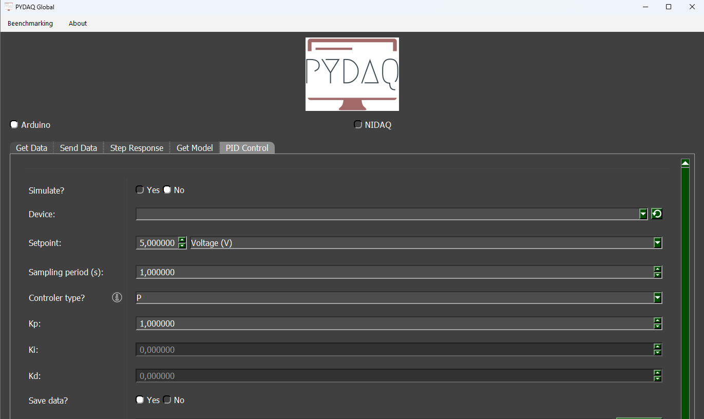
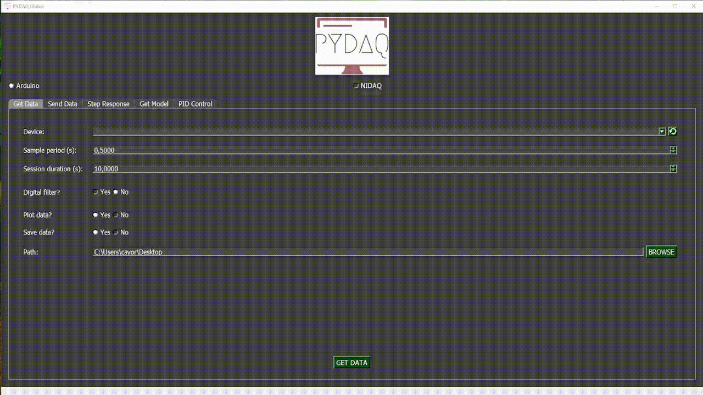

# PID Control with Arduino

**NOTE 1**: Before working with PYDAQ, the device driver should be installed and working correctly as a DAQ (Data Acquisition) device.

**NOTE 2**: To perform control with Arduino, [the code provided here](https://github.com/CayoRw/pydaq/blob/v0.0.6/pydaq/arduino_code/arduino_code_pid.ino) must be uploaded to your Arduino board. The default input port is A0, and the default output port is 13. These ports can be changed in the aforementioned code. This code only works with digital output due to limitations of Arduino boards.

**NOTE 3**: PYDAQ is programmed to use 10 bits as ADC resolution and 0V to 5V as the input range.  
To change this, the user can alter the following variables:

```python
self.arduino_ai_bits = 10
self.ard_ai_max = 5
self.ard_ai_min = 0
```

## Controlling using Graphical User Interface (GUI)

Using the GUI to perform PID control is very straightforward and requires only two lines of code:

```python
from pydaq.pydaq_global import PydaqGui

PydaqGui()
```

After running the command, the GUI will appear. Navigate to the "PID Control" screen, where you can define the parameters and start the control session.



## Parameters

- **Simulate**: If this option is selected, you can enter a mathematical equation to simulate a system and apply PID control to it.

- **Device**: Select the Arduino board connected to your system.

- **Setpoint**: Define the desired reference value for the system.

- **Unit** *(optional)*: Define the unit of measurement for the setpoint (e.g., °C, rpm, volts).

- **Equation** *(optional)*: Define a mathematical transformation for the measured input, if needed.

- **Sampling Period**: Time interval (in seconds) between each data sample.

- **Controller Type**: Choose among P, PI, PD, or PID controllers and configure their respective tuning parameters.

- **Save Data**: Choose whether to save the recorded data during the session.

- **Path**: Define where the data files will be saved.

## Simulated System

If you enable the **Simulate** option, the software will not require a physical device. Instead, you can input the transfer function or system equation, and PYDAQ will simulate its response using the defined controller parameters.

This is useful for testing your control strategy before applying it to a real system.

## Real-Time Control

After adjusting the parameters and starting the control, a new window will open to display the real-time control process. Within this window, you can also modify the PID parameters (**kp**, **ki**, **kd**) and the **setpoint** during execution.

A disturbance input can also be simulated during real-time control. It acts as a negative signal added after the control signal, as illustrated in the figure below.

## Example GIF



# Control PID with Arduino (GUI via code)

It is possible to access the PID Control GUI directly with a few lines of code.

## Example

The following code demonstrates how to automatically find an Arduino board and launch the control interface with predefined PID parameters.

```python
import sys, os, serial.tools.list_ports
from PySide6.QtWidgets import QApplication
from pydaq.pid_control_window_dialog import PID_Control_Window_Dialog

app = QApplication(sys.argv)
plot_window = PID_Control_Window_Dialog()

# Select Arduino port automatically
com_port = serial.tools.list_ports.comports()[0].name
plot_window.check_board(board="arduino", device=com_port, ao=None, ai=None, terminal=None, simulate=False)

# Define PID parameters
kp, ki, kd, setpoint, period = 1.0, 0.2, 0.05, 2.0, 0.1
index, path, save = 3, None, True  

# index = 0 -> P, 1 -> PI, 2 -> PD, 3 -> PID.

# when path = None, by defaut saves to C:\Users\Desktop

plot_window.set_parameters(kp, ki, kd, index, "1", "s+0.2", setpoint, "Voltage (V)", "", "", period, path, save)

# Open GUI
plot_window.exec()
```

- check_board: selects Arduino as the control device.

- set_parameters: sets gains, setpoint, sampling period, and save path.

- exec(): opens the control interface.