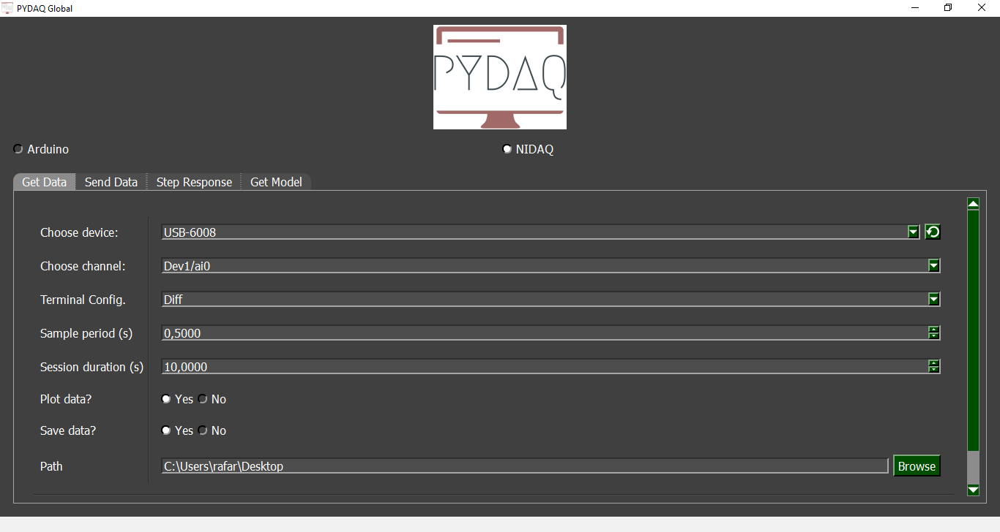
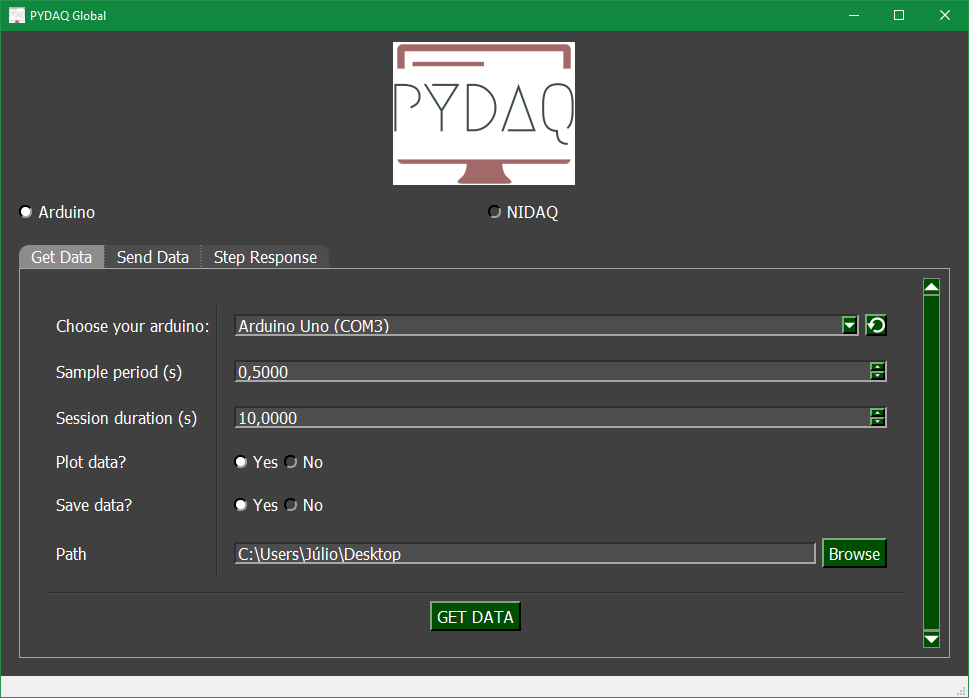
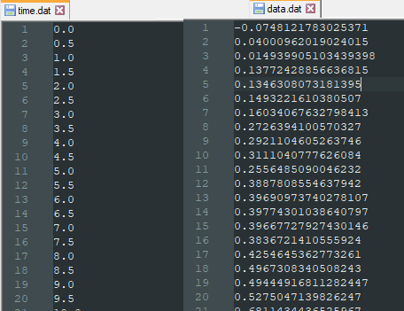
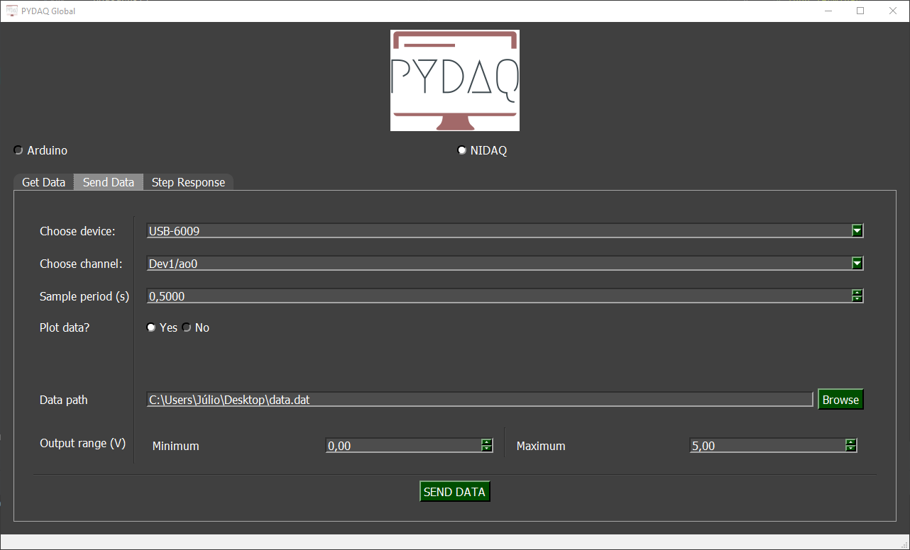
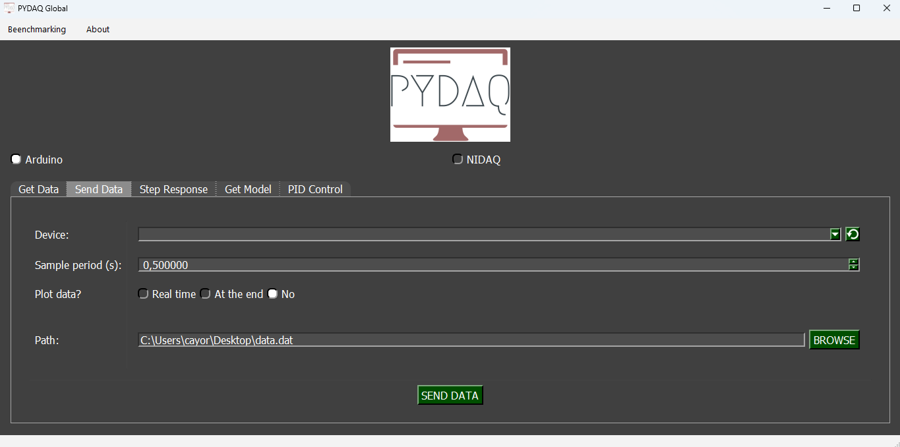
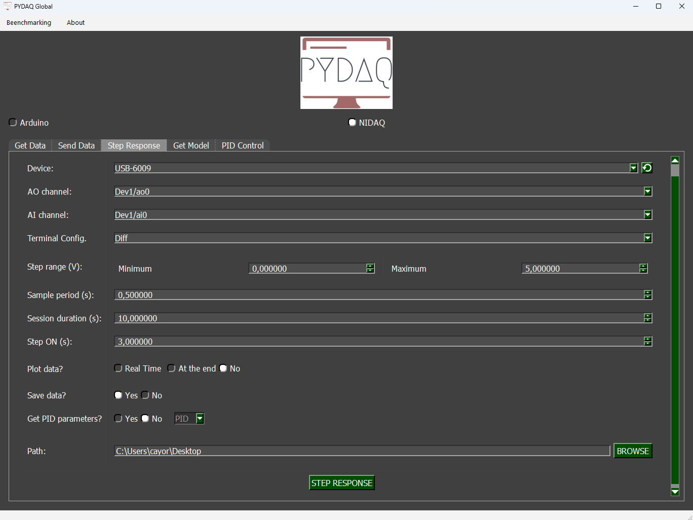
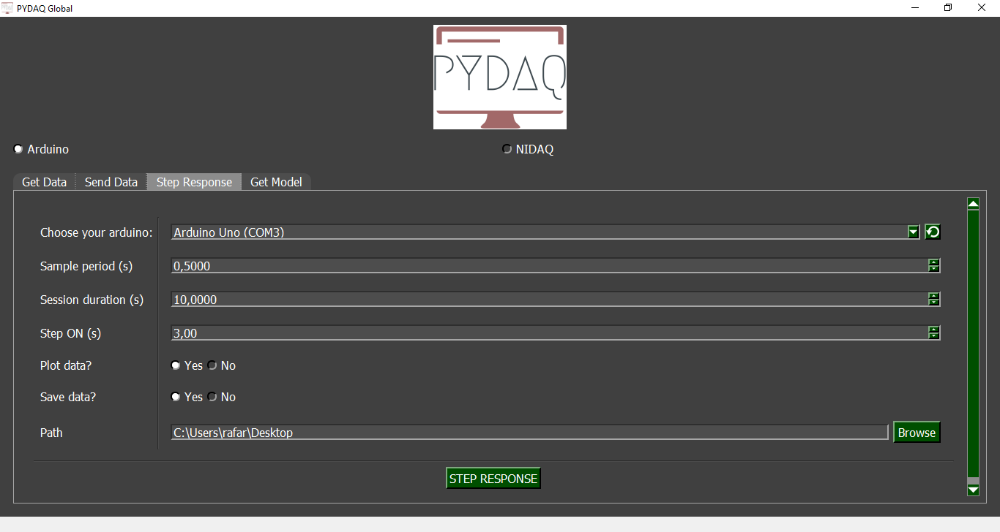

# Summary

System identification is a relevant research topic that aims to find mathematical models 
using acquired data. One of the main contributions is the work of
@Lju1987, which was substantially developed over the years [@MA2016; @WMNL2019]. 
Among system identification tools, SysIdentPy [@Lacerda2020] uses Python in a very 
straightforward way for system modeling through empirical data, while Narmax [@ayala2020r] promises to obtain models 
using R language.

As pointed out by @Lju1987, experimental data are necessary for obtaining 
black-box models, and this is exactly where PYDAQ find its place. PYDAQ is a Python tool 
which was primarily developed for experiments with empirical data, either sending and/or 
acquiring data using simple Graphical User Interfaces or command line, with 
few (or no) lines of code required, using different solutions provided by the 
market (NIDAQ and Arduino). Even a reseacher with no programming skills 
is able to use PYDAQ easily and quickly for data acquisition.

In what follows it will be shown how PYDAQ can be use by any scientist, its advantages and features for 
quickly and effective data acquisition experiments, even if the scientist has no programming skills. 

# Statement of need

Any scientist or student who needs to acquire data in an easy and quick way, 
in three line of code (LOC), are the target audience of this manuscript/package. PYDAQ 
is a solution that aims to allow the user to perform experiments from data acquisition to 
signals generation using a Graphical User Interface. 

Despite this, for advanced users, it is also possible to use PYDAQ through command line, as 
shown in the [documentation](https://samirmartins.github.io/pydaq/), allowing 
PYDAQ to be integrated in real time with well-known modeling tools.

To contextualize the importance of PYDAQ, there are full papers 
dealing only with data acquisition [@Yang2019; @Koerner2020]. It should be clear at this point 
that data acquisition is commonly only the first step 
in an empirical scientific procedure, such as in the work of @Ostrovskii2020. 
Therefore, this step should not take too much energy of a researcher, since he/she 
needs to be full of energy to continue the research project.

Further, PYDAQ deals from different type of data acquisition cards, from 
simple and cheaper Arduino boards up to NIDAQ devices, allowing the execution from simple to complex 
experiments. Also, since PYDAQ can be also used as a command line tool, it can 
be easily incorporated to be used in production along with any available mathematical tool, such 
as SysIdentPy [@Lacerda2020] or SciKitLearn [@scikit-learn].

In literature there are packages that deals with NIDAQ devices, 
such as the NSLS-II tools [@Koerner2020]. However, they need several 
lines of codes in order to make a single data acquisition, and works only with expensive and 
proprietary boards. Besides, as far as I know, there is no Graphical User Interface 
open software that allows instantly and easily data acquisition with Python, this being another 
feature of PYDAQ.

Because of the above-mentioned facts, PYDAQ can be used also to introduce new 
scientist in the System Identification research area. Also, PYDAQ can be used in 
teaching, during engineering courses and in low-cost laboratories' implementation, once 
Arduino boards are quite cheap and easy to find. Graphical User Interfaces also allows 
the user to be directly connected with the subject, as explicitly said by @Silva_2018.

In what follows examples of how to use PYDAQ will be presented, as well as future 
research topics. Further details can also be found in the [documentation](https://samirmartins.github.io/pydaq/). 

# Examples

The fastest way to install PYDAQ is using pip:

```console
pip install pydaq
```

\autoref{fig:nidaq_get_gui} and \autoref{fig:arduino_get_gui} depict 
the Graphical User Interface developed for Data Acquisition using Arduino or any NIDAQ board.

{ width=20%, height=20%}

{ width=20%, height=20%}

To start them, only three line of codes (LOC) are necessary, including one for importing PYDAQ:

```python
from pydaq.get_data import GetData

# Class Get_data
g = GetData()

# Arduino or NIDAQ - Use ONE of the following lines 
g.get_data_nidaq_gui()  # For NIDAQ devices 
g.get_data_arduino_gui()  # For arduino boards
```

Similarly, to send data, only three LOC are required, as showed up in what follow:

```python
from pydaq.send_data import SendData

# Class Send_data
s = SendData()

# Arduino or NIDAQ - Use ONE of the following lines 
s.send_data_nidaq_gui()
s.send_data_arduino_gui()
```

If the user decides to save data, it will be saved in `.dat` format, located at the 
path defined in the GUI (Desktop is the default path). \autoref{fig:data} shows an example of how data will be saved: i) one file (`time.dat`) 
with the timestamp, in seconds, when each sample was acquired; ii) file `data.dat` contains acquired values.

{ width=20%, height=20%}

{ width=20%, height=20%}

{ width=15%, height=15%}

It should be emphasized that once this code is executed, a Graphical User Interface will 
manifest on the screen, according to the board selected by the user, as 
shown in \autoref{fig:arduino_send_gui} and \autoref{fig:nidaq_send_gui}.

Options are straight-forward and ease to understand. For further details and to check 
how to use the same functionality using a command line the reader are invited to 
check the [documentation](https://samirmartins.github.io/pydaq/). 

It is noteworthy that any signal can be generated and applied to a physical 
system using the presented GUI, being the used board the main constraint. Data 
can be either generated manually or using a library (e.g., NumPy) to create 
signals as sine waves, PRBS (Pseudo-Random Binary Signal) or other signal 
required to be a persistently exciting input, as necessary for system identification [@Lju1987; @Bil2013].  

Step-response is a common way to test a system and acquire data, in order to find a model, as well 
as system time constant and gain. To facilitate this procedure, a step-response GUI 
was also created and can be seen in \autoref{fig:step_nidaq} and  \autoref{fig:step_arduino}. 
To use them, user should type the command:

```python
from pydaq.step_response import StepResponse

# Class Step_Response
s = StepResponse()

# Arduino or NIDAQ - Use ONE of the following lines 
s.step_response_nidaq_gui()
s.step_response_arduino_gui()
```


{ width=30%, height=30%}

{ width=20%, height=20%}

Here the user can define when the step will be applied, as well as where data will be saved.
\autoref{fig:data_sent} and \autoref{fig:step_data} show data that were empirically-acquired 
with PYDAQ. In the figures the user will find labels, functionality (Sending Data/Data Acquisition/Step Response), 
device/channel (for NIDAQ boards) or COM port used (for Arduino devices).


{ width=40%, height=40%}

{ width=40%, height=40%}


Examples showed above shed light in some functionalities of PYDAQ. For further 
details and for command line use, the reader is welcome to consult the full 
[documentation](https://samirmartins.github.io/pydaq/).


# Future Work

Future releases will include real-time and data-driven system identification using linear and nonlinear approaches. 
Also, real-time model based controllers will be implemented through PYDAQ. Saving data 
in an SQL server is a future feature, as well.

# References
